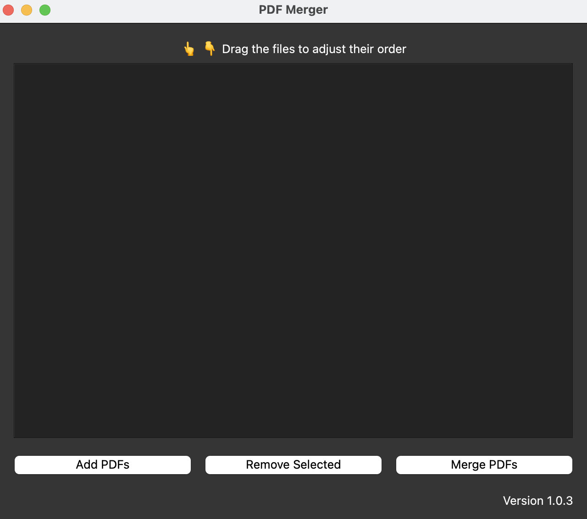

# &nbsp;PDF Merger

$~~~~~~~~~~~$

$~~~~~~~~~~~$

A simple GUI application to merge multiple PDF files into one. This app allows users to select PDF files, reorder them via drag-and-drop, and merge them into a single PDF file.

📢 **The latest version of this application is available on the [GitHub Releases](https://github.com/gillianyiwang/PDFMerger/releases) page.** This app is currently available for **macOS (`.app`)** as standalone executables.

## ⚠️ Bypass System Warnings

Since this is an open-source application, your operating system may display a warning when you try to run it. Follow the steps below to bypass these warnings:

 **macOS**
- Open System Settings and navigate to `Privacy & Security`.
- Scroll to the bottom, where you'll see a message about the app being blocked.
- Click `Use Anyway` to allow the app to run.
- If prompted again when opening the app, click `Open`.

## Features

- **Add PDF Files**: Select multiple PDF files to add to the list.
- **Drag-and-Drop Reordering**: Easily reorder the selected PDF files by dragging them around in the list.
- **Remove PDF Files**: Remove any selected PDF file from the list.
- **Merge PDFs**: Merge the selected PDF files into a single PDF file and save it to the desired location.
- **Customizable Window**: The window can be resized, and it will center on the screen.

## Requirements

- Python 3.x
- Tkinter (for the GUI)
- PyPDF2 (for PDF manipulation)

## Installation

1. Install the required Python libraries:

```bash
pip install -r requirements.txt
```

2. Download or clone the repository.

## Usage

1. Run the Python script:
```bash
python PDFMergerApp.py
```
2. The application window will open, displaying the following options:

- **Add PDFs:** Opens a file dialog to select PDF files.
- **Remove Selected:** Removes the currently selected file from the list.
- **Merge PDFs:** Merges the selected files into a single PDF.
3. Drag and drop PDF files within the list to adjust their order.
4. After merging, the app will prompt you to choose a location to save the merged PDF.

## Application Icon

The application displays an icon in the window and on the taskbar. Ensure the icon file is placed correctly in the project folder, or update the file path as needed.

## Package with PyInstaller 
To package the app into a standalone executable, you can use pyinstaller.

**Steps to Deploy:**
1. Install `pyinstaller` if you haven't already:
```bash
pip install pyinstaller
```
2. Navigate to the directory where `PDFMergerApp.py` is located.
3. Run the following command to create an executable:

**macOS**
```bash
pyinstaller --onefile --windowed --icon icons/PDFMerger_icon.icns --name PDF\ Merger PDFMergerApp.py
```

Explanation of the flags:
- `--onefile`: Creates a single executable file.
- `--windowed`: Prevents a terminal window from opening with the GUI (useful for graphical applications).
- `--icon`: Specifies the icon to use for the application (make sure to provide the path to a .icns file).
- `--name`: Sets the name of the executable.

After running the command, the standalone application will be created in the `dist` folder. You can find the PDFMerger executable inside that folder. If you need to distribute the app to others, you can share the `.app` or `.exe.` file found in the dist folder.


## License

This project is open-source and available under the MIT License.


